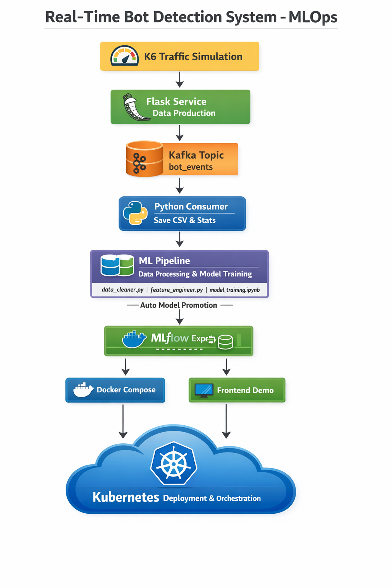

# 🛡️ Bot Detection System – End-to-End MLOps Project

This repository contains a **production-ready bot detection system**, covering the **full MLOps lifecycle**: from **real-time data streaming** to **model deployment on Kubernetes**. The system simulates realistic human and bot traffic, processes the data for machine learning, trains and tracks models, and deploys a REST API for predictions.

---

## 🔹 Features

- **Real-time Data Streaming**  
  Simulates human & bot traffic with **Kafka** and microservices (Flask + K6).  
  Generates session-based behavioral events with multiple actions per session.

- **Data Engineering & Feature Engineering**  
  Clean, preprocess, and enrich data at **session level**.  
  Extract features such as actions per session, session duration, IP type, device/browser info.

- **Machine Learning Pipeline**  
  Models: Logistic Regression, Random Forest, Gradient Boosting.  
  Scikit-learn pipelines with preprocessing & feature encoding.  
  Cross-validation and evaluation metrics: Accuracy, Precision, Recall, F1-score, ROC-AUC.

- **MLOps Workflow with MLflow**  
  Experiment tracking with hyperparameters, metrics, and artifacts.  
  Dataset versioning and reproducibility with hash-based data tracking.  
  Model registry with automatic promotion for top-performing models.

- **Deployment**  
  **FastAPI REST API** for model predictions.  
  Demo frontend (HTML/CSS/JS) for functional testing.  
  Containerized with **Docker**, orchestrated via **Docker Compose**.  
  CI/CD pipeline using **Jenkins → DockerHub → Kubernetes**.

- **Testing & Validation**  
  Pytest unit and integration tests for API, model loading, and preprocessing.  
  Health checks and monitoring endpoints.

---

## Architecture Diagram

---

## 🔹 Tech Stack

Python · Kafka · Flask · K6 · MLflow · scikit-learn · FastAPI · Docker · Docker Compose · Jenkins · Kubernetes 

---

## 🔹 Installation & Setup

### Prerequisites
- Python 3.12+  
- Docker & Docker Compose  
- Kafka & Zookeeper  
- Kubernetes cluster  
- Git

License

MIT License © 2026 Narjess Naili

